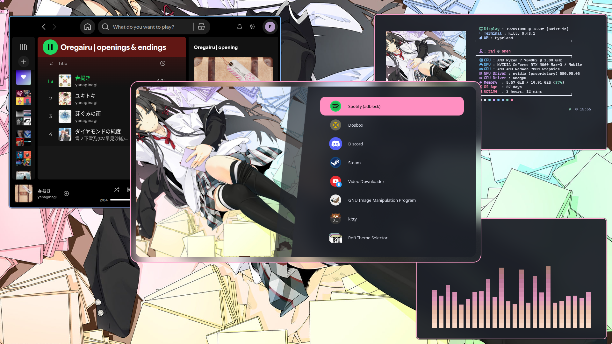
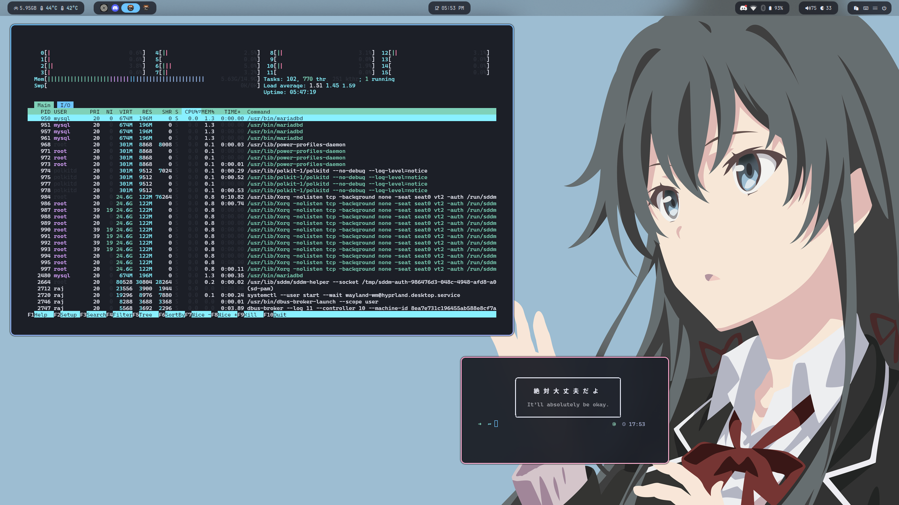
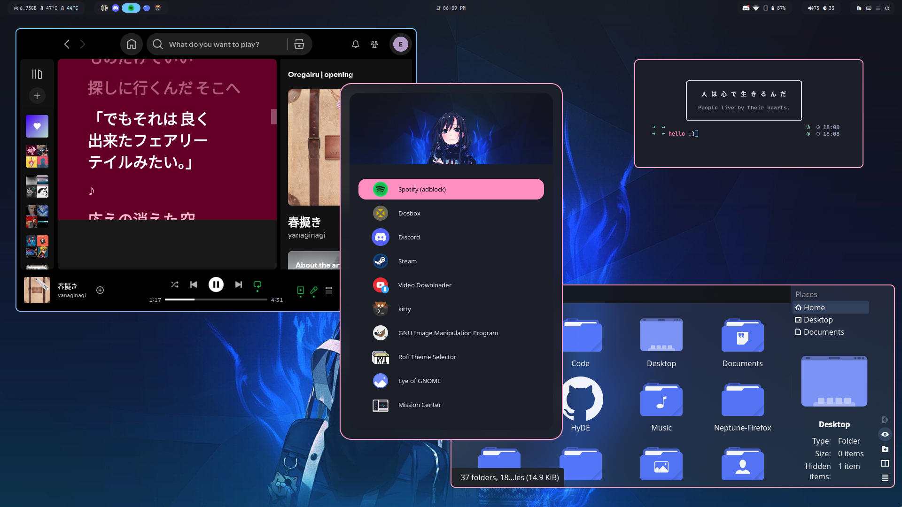

# Oregairu

<div align="center">
    <a href="https://discord.gg/AYbJ9MJez7">
            
    </a>
</div>
<div align="center"><br><br></div>

> **IMPORTANT**
> This is not a standalone theme, it requires [HyDe](https://github.com/Hyde-project/hyde) to be installed.





## Installation

#### HyDE Project

To install **Oregairu** on `HyDE Project`, run the following command:
```sh
hydectl theme import --name "Oregairu" --url https://github.com/elritardato/Oregairu
```

Alternatively, you can import the theme by running:
```sh
hydectl theme import
```

Then choose **Oregairu** from the options.

#### Hyprdots

To install **Oregairu** on `Hyprdots`, run the following command:
```sh
Hyde theme import "Oregairu" https://github.com/elritardato/Oregairu
```

Alternatively, you can import the theme by running:
```sh
Hyde theme import
```

Then choose **Oregairu** from the options.

#### General

Alternatively, you can use a general option that works on both `HyDE Project` and `Hyprdots`:
```sh
~/HyDE/Scripts/themepatcher.sh "Oregairu" https://github.com/elritardato/Oregairu
```
